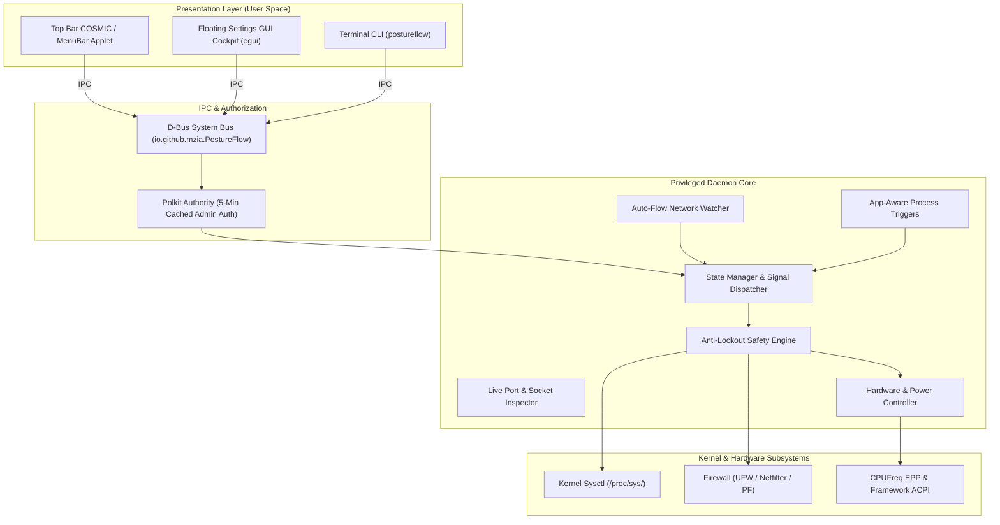

# PostureFlow

[](https://github.com/mzia/PostureFlow/actions/workflows/ci.yml)
[](https://opensource.org/licenses/MIT)
[](https://www.rust-lang.org)
[](macos/README.md)
[](https://system76.com/pop)
[](macos/README.md)
[](https://frame.work)

> **Context-aware security posture, hardware power, and developer service orchestrator for Linux and macOS.**

**PostureFlow** dynamically coordinates your firewall, kernel security parameters, CPU energy preferences, background services (Docker containers & systemd units), and hardware peripherals based on your active environment.

Switch between pre-configured or custom postures manually or autonomously based on connected Wi-Fi SSIDs, VPN tunnels (Tailscale/WireGuard), active applications, or circadian schedules—backed by strict anti-lockout safety invariants.

---

## ⚡ The 4 Postures at a Glance

| Posture | Context | Firewall & Network | Kernel & Debugging | Power & Hardware |
| :--- | :--- | :--- | :--- | :--- |
| 🏠 **Home** | Couch, streaming, gaming | LAN trusted, Steam Remote Play & LocalSend enabled | `vm.max_map_count` 1M (Proton ready), 524k file watchers | Balanced power, 30m display lock |
| 💼 **Work** | Office, corporate network | Corporate VPN (`tun+`/`wg+`) unblocked; dev ports blocked to LAN | Standard compliance, crash dumps disabled | Balanced power, 5m auto-lock |
| 💻 **Dev** | Coding, testing, lab | Dev ports allowed (`3000`, `8000`, `8080`...), Docker subnet bridged | Full debugger attach (`ptrace`), 524k hot-reload watchers | Performance EPP, Docker auto-running |
| ✈️ **Travel** | Coffee shops, airports, hotel Wi-Fi | **100% Inbound Stealth Block**; WAN locked down | Anti-memory scraping (`ptrace_scope 2`), core dumps disabled | Power-saver EPP, Bluetooth stealth, 5m lock |

---

## 🚀 Quick Start

### 1. Install

#### Linux (Pop!_OS / Ubuntu / Debian)
```bash
# Option A: Install via pre-built Debian package (Recommended)
sudo dpkg -i dist/postureflow_1.0.1_amd64.deb

# Option B: Install from source
git clone https://github.com/mzia/PostureFlow.git && cd PostureFlow
sudo ./install.sh
```

#### macOS (Apple Silicon & Intel)
```bash
cd macos
swift build
swift run PostureFlowApp   # Launches the native menu bar extra app
```
*See the [macOS Documentation & Architecture](macos/README.md) for Touch ID, PF firewall, and Apple Silicon power controls.*

#### Flatpak (Sandboxed GUI)
```bash
make flatpak
flatpak install --user dist/io.github.mzia.PostureFlow.flatpak
flatpak run io.github.mzia.PostureFlow
```

---

### 2. Daily CLI Usage

```bash
# Switch postures (requires admin)
sudo postureflow --home       # Relaxed: streaming, gaming, local LAN sharing
sudo postureflow --work       # Hardened: office LAN lockdown, VPN tunnels unblocked
sudo postureflow --dev        # Developer: debuggers enabled, dev ports open
sudo postureflow --travel     # Stealth: 100% inbound block, public Wi-Fi lockdown
sudo postureflow --reset      # Instant revert to factory defaults

# Live status & audits (no sudo required)
postureflow --status          # View current posture, firewall policy & battery limits
postureflow --score           # Real-time Security Posture Score (0-100%, Grade A+ to F)
postureflow --ports           # Inspect listening sockets, exposure scope & process owners
postureflow --autoflow        # Inspect autonomous Wi-Fi SSID & VPN auto-shift rules
```

---

## 🖥️ User Interfaces

### 1. Panel Applet & Menu Bar Extra
Available in the **COSMIC top panel**, **Ubuntu/GNOME tray**, and **macOS Menu Bar**:
* **Live Dynamic Icon:** Switches visual badges automatically (🏠 Hearth, 💼 Workstation, 💻 Code prompt `<_>`, ✈️ Shackle).
* **Hover Status:** Instant tooltip showing active posture, security score, active SSID, and trigger state.
* **1-Click Switching:** Left-click to instantly cycle postures with Polkit/Touch ID cached authentication.
* **Direct Launcher:** Quick access to the visual Settings GUI and Port Inspector.

```bash
# Run Linux applet manually (autostarted via systemd by default):
postureflow-applet
```

### 2. Desktop Settings GUI (`postureflow-gui`)
Hardware-accelerated desktop cockpit built with `egui`:
* **🛡️ Security Cockpit:** Real-time 100-point security grade with itemized penalty audit breakdown.
* **🔌 Port Inspector:** Live `/proc/net` socket auditor with one-click **`🚫 Block Port`** via UFW.
* **⚡ Auto-Flow Manager:** Visual configuration for SSID and VPN roaming triggers.
* **🎮 App Triggers:** Rules to boost performance or lock down security when specific applications launch.
* **🏷️ Profiles & TOML:** Custom profile editor with 1-click TOML import/export and safety testing.

```bash
postureflow-gui
```

---

## 🛠️ Key Capabilities

* **🌐 Autonomous Network Detection (Auto-Flow):** Automatically detects trusted Home Wi-Fi, Office LAN, untrusted public hotspots, or Tailscale/WireGuard mesh tunnels and shifts profiles without user intervention.
* **🎮 App-Aware Dynamic Triggers:** Detects when specific applications (IDEs, games, conferencing apps) launch, applies temporary profile overrides, and cleanly reverts on process termination.
* **🐳 Developer Service Lifecycle:** Pauses Docker containers (`docker pause`) and stops dev background units when leaving Dev mode, automatically resuming them upon return.
* **⚡ Hardware & Battery Optimization:** Controls CPU Energy Performance Preference (EPP), Framework Laptop battery charge limits (e.g. 80%), Bluetooth radio stealth, and BadUSB protection.
* **🔒 Anti-Lockout Invariants:** Enforces strict kernel-level guarantees so that loopback IPC (`lo`), established SSH connections, and default internet egress can never be severed.

---

## 📝 Custom Profiles

Custom profiles are stored as `.postureflow.toml` files in `/etc/postureflow/profiles.d/` (system) or `~/.config/postureflow/profiles.d/` (user):

```toml
[profile]
id = "ai-lab"
name = "AI & ML Development Lab"
description = "Optimized for local LLM inference, PyTorch, and Ollama"
category = "development"

[firewall]
default_incoming = "deny"
default_outgoing = "allow"
allow_loopback = true
allowed_interfaces = ["lo", "docker0"]

[[firewall.ports]]
port = 11434
proto = "tcp"
comment = "Ollama Local API"

[kernel]
ptrace_scope = 1
inotify_max_user_watches = 1048576

[framework]
battery_charge_limit = 80
platform_energy_profile = "performance"
```

---

<details>
<summary><b>🏛️ System Architecture & Mermaid Diagram (Click to expand)</b></summary>



</details>

---

<details>
<summary><b>🔌 D-Bus API Reference (`io.github.mzia.PostureFlow`) (Click to expand)</b></summary>

| Method / Signal | Signature | Description |
| :--- | :--- | :--- |
| `GetActiveProfile` | `() -> (s)` | Returns active profile ID (`home`, `work`, `dev`, `travel`, etc.). |
| `SetProfile` | `(s) -> ()` | Applies profile rules and broadcasts change signal. |
| `GetStatus` | `() -> (s)` | Returns live firewall, kernel sysctl, and power report. |
| `ResetToDefaults` | `() -> ()` | Reverts system settings to factory Pop!_OS defaults. |
| `GetPostureScore` | `() -> (i, s)` | Returns real-time score (0-100) and itemized audit JSON. |
| `GetListeningPorts` | `() -> (s)` | Returns JSON array of listening sockets, PIDs, and process names. |
| `BlockPort` | `(q, s) -> ()` | Immediately denies incoming traffic on a port via firewall. |
| `GetAutoFlowStatus` | `() -> (b, s, s)` | Returns `(enabled, active_ssid, matched_profile)`. |
| `ProfileChanged` | `(s)` [Signal] | Broadcasts when a profile switch occurs. |

</details>

---

<details>
<summary><b>📂 Repository Structure (Click to expand)</b></summary>

```text
postureflow/
├── bin/postureflow                  # Standalone CLI client
├── src/
│   ├── main.rs                      # Privileged D-Bus system daemon
│   ├── system.rs                    # Sysctl, firewall, and hardware controller
│   ├── dbus.rs                      # D-Bus service implementation
│   ├── config/                      # TOML profile schema & anti-lockout validator
│   ├── applet/                      # Top bar panel applet (StatusNotifierItem)
│   ├── inspector/                   # Live socket auditor & posture scorer
│   ├── autoflow/                    # NetworkManager SSID & VPN watcher
│   ├── triggers/                    # App-aware process scanner & auto-reverter
│   └── schedule/                    # Circadian scheduler & battery monitor
├── macos/                           # Native macOS SwiftUI app & PF firewall engine
├── data/                            # Desktop entries, D-Bus configs, Polkit policies, icons
├── completions/                     # Bash and Zsh shell completions
├── scripts/                         # Package build & source generator scripts
├── tests/                           # Safety and D-Bus integration tests
└── install.sh                       # One-line system installer
```

</details>

---

## 🛡️ Security Auditing & Vulnerability Scanning

PostureFlow integrates dual-layer vulnerability scanning powered by **RustSec Advisory Database** and **Snyk SAST**:

```bash
# Run security vulnerability audit locally (Cargo dependencies + Snyk Code)
make scan

# Run Snyk static application security testing (SAST)
make snyk
```

* **Automated CI/CD:** GitHub Actions ([`.github/workflows/snyk.yml`](.github/workflows/snyk.yml)) audits dependencies on every PR and runs weekly scheduled scans.
* **SARIF Integration:** Security findings upload directly to GitHub Code Scanning when `SNYK_TOKEN` is configured in repository secrets.

---

## 🗑️ Uninstallation

To cleanly remove PostureFlow and restore all firewall, power, and kernel settings to factory defaults:
```bash
sudo ./uninstall.sh
```

---

## 📄 License

MIT © M. Zia
