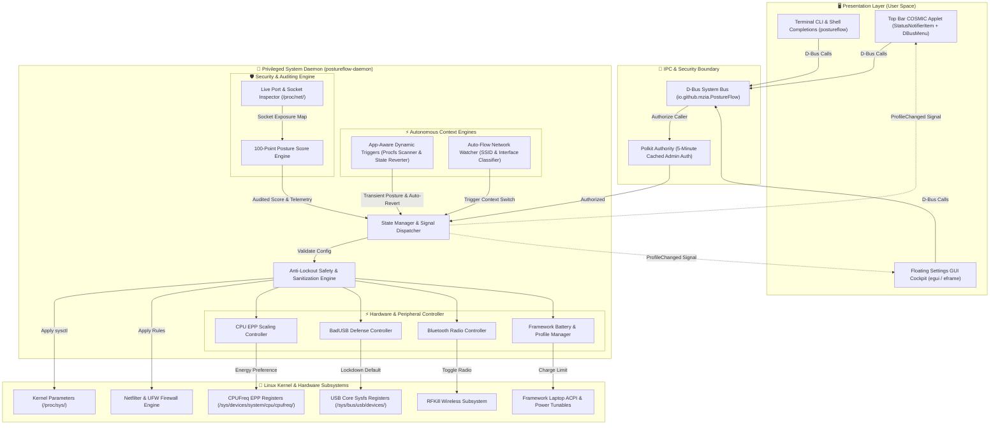

# PostureFlow

[](https://github.com/mzia/PostureFlow/actions/workflows/ci.yml)
[](https://opensource.org/licenses/MIT)
[](https://www.rust-lang.org)
[](https://system76.com/pop)
[](https://frame.work)

> **Dynamic security posture, hardware power, and lifestyle workflow orchestrator for Linux & Pop!_OS laptops.**

`PostureFlow` dynamically bridges the gap between paranoid security, frictionless software engineering, and casual entertainment. Switch postures with a single command or status bar click without ever risking lockout from your laptop.

---

## ⚡ Quick Start

### Option 1: Install via Pre-Built Debian Package (Recommended)

Download the latest `.deb` from [GitHub Releases](https://github.com/mzia/PostureFlow/releases) and install:
```bash
sudo dpkg -i dist/postureflow_1.0.0_amd64.deb
```

### Option 2: Install from Source

```bash
git clone https://github.com/mzia/PostureFlow.git
cd PostureFlow

# Build Rust binaries and Debian package
make deb
sudo dpkg -i dist/postureflow_1.0.0_amd64.deb

# Or install directly with the installer script
sudo ./install.sh
```

### Option 3: Install via Flatpak Bundle

```bash
# Build and install the sandboxed Flatpak package
make flatpak
flatpak install --user dist/io.github.mzia.PostureFlow.flatpak

# Run Flatpak application
flatpak run io.github.mzia.PostureFlow
```

Now switch postures anytime:
```bash
sudo postureflow --home      # Streaming, Proton gaming, phone sync (GSConnect)
sudo postureflow --work      # Office & corporate VPN (dev ports blocked to LAN)
sudo postureflow --dev       # Coding & debugging (ptrace allowed, 524k file watchers)
sudo postureflow --travel    # Coffee shops, airports & public Wi-Fi (stealth mode, alias: --secure)
sudo postureflow --reset     # Reset all settings back to Pop!_OS factory defaults
postureflow --status         # Inspect live posture without sudo
postureflow --score          # Calculate real-time Security Posture Score (0-100%, Grade)
postureflow --ports          # Inspect live listening sockets & process owners
postureflow --autoflow       # Check autonomous network detection & SSID rules
```

---

## 🎯 Why PostureFlow?

Linux security tools (like UFW, firewalld, or raw sysctl) are static. But laptop users live in dynamic contexts:

* **The Dev Friction Problem:** Strict security (`ptrace_scope = 2`) blocks `gdb`, `lldb`, and VS Code from debugging processes. Default `inotify` limits crash Vite and Webpack. Devs end up turning off security entirely.
* **The Corporate Leak Risk:** Running a local dev server (`0.0.0.0:3000`) or test database on a corporate office Wi-Fi exposes your code and data to everyone on the subnet.
* **The Home Entertainment Barrier:** Overly aggressive firewalls break Steam Remote Play, local game downloads, and phone sync (GSConnect/LocalSend).
* **The Update Drift Problem:** Every `apt upgrade` or kernel bump wipes runtime sysctl tuning and resets UFW configurations.

`PostureFlow` solves all of this with zero dependencies, a native Rust D-Bus daemon, Polkit cached authorization, and built-in anti-lockout guarantees.

---

## 📊 The Four Profiles

| Feature / Setting | 🏠 Home | 💼 Work | 💻 Dev | ✈️ Travel |
| :--- | :--- | :--- | :--- | :--- |
| **Context** | Couch / Streaming / Gaming | Office / Corporate VPN | Coding / Testing / Lab | Coffee shop / Airport (Lockdown) |
| **Inbound Firewall** | LAN trusted, WAN blocked | WAN blocked, VPN allowed | Dev ports open | **100% Blocked (Stealth)** |
| **Dev Ports (3000, 8000...)** | ❌ Blocked | ❌ **Strictly blocked to LAN** | ✅ **Allowed** | ❌ Blocked |
| **Corporate VPNs** | Allowed | ✅ **Unblocked (`tun+`, `wg+`)** | Allowed | Outbound only |
| **Steam Remote Play** | ✅ **Allowed (`27031-27040`)**| ❌ Blocked | ❌ Blocked | ❌ Blocked |
| **Phone Sync (GSConnect)** | ✅ **Allowed (`1714-1764`)** | ❌ Blocked | ❌ Blocked | ❌ Blocked |
| **LocalSend Sharing** | ✅ **Allowed (`53317`)** | ❌ Blocked | ❌ Blocked | ❌ Blocked |
| **Proton Gaming (`vm.max_map`)**| **`1,048,576` (No crashes)**| Default | Default | Default |
| **Debugger Hooking (`ptrace`)**| `1` (Overlays hook) | `1` (Standard) | `1` (Full debugger attach) | `2` **(Anti-memory scraping)** |
| **File Watchers (`inotify`)** | 524,288 | 524,288 | **524,288 (Hot-reload ready)**| Default |
| **Crash Dumps** | Enabled | Disabled | **Enabled for `gdb`** | **Disabled (No key leaks)** |
| **Screen Lock Timeout** | **30 minutes** | **5 minutes (Compliance)** | **15 minutes** | **5 minutes** |

---

## 🔒 Anti-Lockout Invariants

`PostureFlow` is built around safety invariants ensuring you can **never lock yourself out**:

1. **SSH Auto-Preservation:** If an active SSH session or daemon is detected, port `22/tcp` is automatically whitelisted before the firewall is touched.
2. **Loopback IPC Guarantee:** Explicit `allow on lo` rules guarantee desktop environments (Wayland, X11, COSMIC, GNOME), PipeWire audio, and D-Bus never freeze.
3. **Outbound Internet Egress:** Default-allow outgoing stateful tracking ensures browsing, DNS, and package updates never break.
4. **PAM & Sudo Untouched:** User authentication and login files are never modified.

Run the test suite anytime:
```bash
postureflow --test
```

---

## 🏛️ System Design & Architecture

`PostureFlow` is architected as an asynchronous, event-driven system orchestrator built entirely in native Rust. It decouples high-level user interfaces and autonomous triggers from low-level Linux kernel and hardware enforcement mechanisms through a privileged system daemon and PolicyKit security boundary.

### High-Level Architecture



---

### Architectural Layers

#### 1. Presentation & Interaction Layer
* **COSMIC Panel Applet (`postureflow-applet`):** Native Freedesktop StatusNotifierItem (SNI) and DBusMenu provider running in the user session. It provides live symbolic iconography matching the desktop theme, one-click profile cycling, and desktop notification dispatching via `org.freedesktop.Notifications`.
* **Floating Settings GUI & Security Cockpit (`postureflow-gui`):** Hardware-accelerated desktop window built with `egui`/`eframe`. Houses the real-time Security Cockpit, Live Port Inspector, Auto-Flow network manager, App Triggers editor, and tabbed Profile Designer with one-click TOML import/export.
* **Terminal CLI (`postureflow`):** Fast, standalone command-line client with zero external dependencies and integrated Bash/Zsh tab-completions.

#### 2. IPC & Authorization Boundary
* **D-Bus System Bus (`io.github.mzia.PostureFlow`):** Asynchronous IPC bus managed with `zbus`. Exposes methods for profile switching, configuration queries, port blocking, and autonomous engine control. Emits the broadcast signal `ProfileChanged` to guarantee all frontends synchronize immediately.
* **Polkit Security Authority (`org.freedesktop.PolicyKit1`):** Governs privileged mutations (`io.github.mzia.PostureFlow.set-profile`). Employs `auth_admin_keep` caching: prompts once on initial desktop profile switch or import, enabling seamless adjustments for the subsequent 5 minutes without nagging the user.

#### 3. Privileged Daemon Core (`postureflow-daemon`)
* **State Manager & Signal Dispatcher:** Holds the active profile in memory, applies runtime state transitions, and notifies subscribed clients over D-Bus upon posture mutation.
* **Anti-Lockout Safety Engine:** Validates all configuration files against non-negotiable security invariants (SSH preservation, loopback guarantee, pipe-injection protection, eBPF sanitization).
* **Autonomous Context Engines:**
  - **Auto-Flow:** Watches NetworkManager D-Bus signals and network interface states to automatically adapt postures when roaming between trusted home Wi-Fi, corporate subnets, and untrusted coffee shop hotspots.
  - **App-Aware Dynamic Triggers:** Sub-millisecond `/proc` comm scanner that detects target processes (e.g. Steam, Docker, VS Code) and applies temporary profile overrides. Captures baseline state and automatically reverts parameters when the process terminates.
* **Security Cockpit & Socket Inspector:** Directly parses `/proc/net/{tcp,udp,tcp6,udp6}`, maps socket inodes to running PIDs/process names in `/proc/<pid>/fd`, evaluates exposure boundaries (Localhost vs Local Subnet vs Public WAN), and computes a 100-point security posture score.
* **Deep Hardware Orchestrator:** Manages CPU Energy Performance Preference (`energy_performance_preference`) across all CPU cores, toggles kernel BadUSB protection (`authorized_default = 0`), commands Bluetooth radio states via `rfkill`, and controls Framework Laptop battery charging thresholds and thermal profiles.

#### 4. Linux Kernel & Subsystem Enforcement
* **Sysctl Subsystem (`/proc/sys/`):** Hardens kernel memory, network stacks, and security parameters (`kernel.yama.ptrace_scope`, `net.core.bpf_jit_harden`, `fs.inotify.max_user_watches`, `fs.suid_dumpable`).
* **Netfilter & UFW:** Reconfigures inbound/outbound firewall rules, port whitelists, and interface bindings on the fly without breaking established connections.
* **Kernel Sysfs & RFKill:** Directly writes to `/sys/devices/system/cpu/cpufreq/policy*/energy_performance_preference`, `/sys/bus/usb/devices/usb*/authorized_default`, and controls wireless radios.

---

### D-Bus API Specification (`io.github.mzia.PostureFlow`)

| Member | Type | Signature | Description |
| :--- | :--- | :--- | :--- |
| `GetActiveProfile` | Method | `() -> (s)` | Returns active profile identifier (`home`, `work`, `dev`, `travel`, or custom). |
| `SetProfile` | Method | `(s) -> ()` | Validates posture, applies kernel/firewall/power rules, and broadcasts signal. |
| `GetStatus` | Method | `() -> (s)` | Returns live kernel, UFW firewall, and Framework power status report. |
| `ResetToDefaults` | Method | `() -> ()` | Restores system settings to factory Pop!_OS defaults. |
| `ListProfiles` | Method | `() -> (as)` | Discovers and returns all built-in and custom profile IDs. |
| `GetProfileDetails` | Method | `(s) -> (s)` | Returns the complete declarative TOML configuration for any profile. |
| `ValidateProfile` | Method | `(s) -> (b, s)` | Validates TOML against anti-lockout rules, returning sanitized TOML or error. |
| `SaveCustomProfile` | Method | `(s, s) -> ()` | Saves a validated profile TOML to `/etc/postureflow/profiles.d/<id>.postureflow.toml`. |
| `DeleteCustomProfile`| Method | `(s) -> ()` | Removes a custom profile from `/etc/postureflow/profiles.d/`. |
| `GetPostureScore` | Method | `() -> (i, s)` | Returns real-time score (0-100) and itemized audit report JSON. |
| `GetListeningPorts` | Method | `() -> (s)` | Returns JSON array of all active listening sockets, PIDs, and process names. |
| `BlockPort` | Method | `(q, s) -> ()` | Immediately denies and blocks incoming traffic on a port via UFW. |
| `GetAutoFlowStatus` | Method | `() -> (b, s, s)` | Returns `(enabled, active_network_ssid, matched_profile)`. |
| `SetAutoFlowEnabled`| Method | `(b) -> ()` | Enables or disables the autonomous network watcher daemon engine. |
| `GetAutoFlowConfig` | Method | `() -> (s)` | Returns the active `autoflow.toml` configuration content. |
| `SaveAutoFlowConfig`| Method | `(s) -> ()` | Updates and saves `/etc/postureflow/autoflow.toml`. |
| `GetTriggersStatus` | Method | `() -> (b, s)` | Returns `(enabled, active_trigger_rule_name)`. |
| `GetTriggersConfig` | Method | `() -> (s)` | Returns current App Triggers configuration TOML content. |
| `SaveTriggersConfig`| Method | `(s) -> ()` | Updates and saves `/etc/postureflow/triggers.toml`. |
| `ProfileChanged` | Signal | `(s)` | Broadcasts when a profile switch occurs. |

---

## 🖥️ Desktop Top Bar & COSMIC Panel Applet

`postureflow-applet` integrates directly into the **Pop!_OS COSMIC desktop panel** and standard Freedesktop system trays:

* **Real-time Symbolic Icons:** Automatically synchronizes with your active profile:
  - 🏠 **Home:** `user-home-symbolic`
  - 💼 **Work:** `applications-office-symbolic`
  - 💻 **Dev:** `utilities-terminal-symbolic`
  - ✈️ **Travel:** `security-high-symbolic` (alias: `secure`)
* **One-Click Native Popover Menu:** Powered by the standard `com.canonical.dbusmenu` protocol, rendered natively inside the panel using your active desktop theme and accent colors.
* **Instant Profile Cycling:** Left-click the panel icon directly to cycle instantly through profiles (`Home` ➔ `Work` ➔ `Dev` ➔ `Travel`).
* **Direct GUI Launcher:** Click **`⚙ Configure Profiles & Import...`** to open the floating settings GUI.
* **Desktop Notifications:** Dispatches native notifications on profile changes and security posture audits via `org.freedesktop.Notifications`.
* **Resilient Watchdog:** Automatically reconnects and re-registers whenever the desktop shell or session restarts.
* **Session Autostart:** Ships with a systemd user service (`postureflow-applet.service`) and standard desktop entry (`io.github.mzia.PostureFlow.Applet.desktop`).

### Running the Applet
```bash
# Start in background session
postureflow-applet

# Query current posture
postureflow-applet --status

# Quick cycle next profile
postureflow-applet --cycle

# Reset all settings to factory defaults via D-Bus daemon
postureflow-applet --reset
```

---

## 🎨 Floating Desktop Settings GUI (`postureflow-gui`)

`postureflow-gui` provides a rich, hardware-accelerated desktop application designed to open as a floating tile (`io.github.mzia.PostureFlow`):

* **Main Navigation Tabs:**
  - **🛡️ Security Cockpit:** Real-time 100-point security score (0-100%, Grade A+ through F), live profile badge, system security state matrix (Firewall, Sysctl, Framework Power, BadUSB defense, Bluetooth stealth), and an itemized penalty audit breakdown.
  - **🔌 Port Inspector:** Live socket auditor reading `/proc/net/*`, mapping listening sockets to running PIDs and process names, categorizing exposure levels (`Localhost`, `Local Subnet`, `Public / Insecure`), and providing one-click **`🚫 Block Port`** via UFW.
  - **⚡ Auto-Flow (Network):** Autonomous network context manager. Visualizes active Wi-Fi SSID / Ethernet interfaces, prioritizes roaming rules, and provides a master toggle.
  - **🎮 App Triggers:** Real-time process-triggered overrides (Steam gaming boost, Docker dev containers, office apps). Displays active trigger badges, rule list, and an in-app trigger rule creator with auto-reversion.
  - **🏷️ Profiles Manager:** Sidebar of custom and built-in profiles, 1-click TOML import/export, factory defaults reset, safety verification, and a tabbed profile editor:
    - **General:** Profile ID, Name, Description, and Category tags.
    - **Firewall & Ports:** Default inbound/outbound policies, loopback isolation, interface whitelists, and an interactive port rules editor (TCP/UDP with custom descriptions).
    - **Kernel & Sysctl:** Fine-tune sysctl parameters against safe whitelisted keys (`ptrace_scope`, `bpf_jit_harden`, `inotify.max_user_watches`, etc.) and system security limits (`nofile`).
    - **Power & Framework:** Set battery charge thresholds (e.g. 80% for battery health), energy performance profiles, CPU EPP scaling register (`performance`, `balance_performance`, `balance_power`, `power`), BadUSB defense (`block_new_usb`), Bluetooth radio stealth (`disable_bluetooth`), and display sleep timeouts.
* **1-Click Import & Export:**
  - **`📥 Import Config`**: Pick any `.postureflow.toml` file to inspect, validate, and install into `/etc/postureflow/profiles.d/`.
  - **`📤 Export Config`**: Export custom or built-in profiles to share with teammates.
* **Factory Defaults Reset**: One-click **`🔄 Reset to Factory Defaults`** with safety confirmation dialog to immediately restore unmanaged out-of-the-box settings (UFW disabled, balanced power profile, battery 100%, and default 15-minute idle delay).
* **Interactive Safety Verification:** Test configuration safety in real time before saving or applying with the **`Test & Verify Safety`** button.
* **Instant Activation:** Apply changes system-wide with **`⚡ Activate Profile`**.

---

## 📝 Custom Profiles & Declarative TOML Schema

Custom profiles are stored as `.postureflow.toml` files in `/etc/postureflow/profiles.d/` (system-wide) or `~/.config/postureflow/profiles.d/` (user-specific).

### Example Configuration: `ai-lab.postureflow.toml`

```toml
[profile]
id = "ai-lab"
name = "AI & ML Development Lab"
description = "Optimized for local LLM inference, PyTorch, Ollama, and WebUI"
category = "development"

[firewall]
default_incoming = "deny"
default_outgoing = "allow"
allow_loopback = true
allowed_interfaces = ["lo", "docker0"]

[[firewall.ports]]
port = 11434
proto = "tcp"
comment = "Ollama Local API"

[[firewall.ports]]
port = 8080
proto = "tcp"
comment = "Local WebUI / Open-WebUI"

[kernel]
ptrace_scope = 1
bpf_disabled = 2
inotify_max_user_watches = 1048576

[framework]
battery_charge_limit = 80
platform_energy_profile = "performance"
idle_timeout_seconds = 1800
```

### Strict Anti-Lockout Validation

Every imported or saved profile is checked by the safety validator:
1. **Loopback Protection:** `allow_loopback` is forcibly set to `true` to ensure Wayland, X11, D-Bus, and audio never freeze.
2. **eBPF Safety:** `bpf_disabled = 1` is automatically sanitized to `2` to prevent irreversible runtime locks that would block tools until reboot.
3. **Pipe Injection Prevention:** Sysctl keys like `fs.suid_dumpable` or `kernel.core_pattern` cannot contain pipe characters (`|`) to prevent privilege escalation.
4. **Sysctl Whitelisting:** Only vetted, safe kernel performance and security keys can be altered.

---

## 🔄 Self-Healing Post-Upgrade Hook

`PostureFlow` includes an APT post-invoke hook registered at `/etc/apt/apt.conf.d/99-postureflow-health`. 

Whenever an `apt upgrade`, kernel update, or patch finishes installing, the hook automatically validates and re-applies your profile settings in the background.

---

## 📖 Manual Page & Completions

* **Manual Page:**
  ```bash
  man postureflow
  ```
* **Shell Completions:** Automatically installed for **Bash** (`/etc/bash_completion.d/postureflow`) and **Zsh** (`/usr/share/zsh/vendor-completions/_postureflow`).

---

## 📂 Repository Structure

```text
postureflow/
├── bin/
│   └── postureflow                  # Standalone CLI executable
├── src/
│   ├── lib.rs                       # Shared library modules
│   ├── main.rs                      # Rust D-Bus daemon entrypoint
│   ├── profile.rs                   # Profile enum & icon mappings
│   ├── system.rs                    # System controller (sysctl, ufw, limits, power)
│   ├── dbus.rs                      # Native zbus D-Bus service (PostureFlow)
│   ├── config/                      # Declarative profile engine
│   │   ├── mod.rs                   # Built-in profile definitions & directory scanner
│   │   ├── schema.rs                # Serde TOML schema (firewall, kernel, framework)
│   │   └── validator.rs             # Strict anti-lockout safety validation
│   ├── bin/
│   │   ├── postureflow-applet.rs    # Top Bar / COSMIC Panel Applet entrypoint
│   │   └── postureflow-gui.rs       # Floating settings GUI entrypoint
│   ├── applet/
│   │   ├── mod.rs                   # Applet module definitions
│   │   ├── state.rs                 # Thread-safe profile state manager
│   │   ├── client.rs                # System daemon proxy & notifications
│   │   ├── menu.rs                  # com.canonical.dbusmenu provider
│   │   └── sni.rs                   # org.kde.StatusNotifierItem provider
│   ├── inspector/                   # Security auditing & socket inspector
│   │   ├── mod.rs                   # Inspector module definition
│   │   ├── ports.rs                 # Live socket inspection & process resolution
│   │   └── score.rs                 # 100-point security scoring engine
│   ├── autoflow/                    # Autonomous network context engine
│   │   └── mod.rs                   # NetworkManager D-Bus / SSID event watcher
│   └── triggers/                    # App-aware dynamic process triggers engine
│       └── mod.rs                   # Procfs scanner, rule engine & auto-revert state
├── data/
│   ├── io.github.mzia.PostureFlow.desktop         # Floating GUI settings desktop entry
│   ├── io.github.mzia.PostureFlow.Applet.desktop  # Top bar panel applet desktop entry
│   ├── io.github.mzia.PostureFlow.metainfo.xml    # AppStream 1.0 metadata
│   ├── icons/
│   │   └── io.github.mzia.PostureFlow.svg         # High-resolution vector icon
│   ├── postureflow-applet.service                 # Systemd user session autostart service
│   ├── postureflow-daemon.service                 # Systemd privileged system service
│   ├── io.github.mzia.PostureFlow.policy          # Polkit 5-min cached admin authorization
│   └── io.github.mzia.PostureFlow.conf            # D-Bus system bus permissions
├── io.github.mzia.PostureFlow.yml                 # Flatpak application manifest
├── man/
│   └── postureflow.1                              # Native Linux manual page
├── completions/
│   ├── postureflow.bash                           # Bash auto-completion
│   └── postureflow.zsh                            # Zsh auto-completion
├── scripts/
│   ├── build_deb.sh                               # Automated Debian .deb package builder
│   ├── build_flatpak.sh                           # Flatpak build and bundle script
│   └── generate_cargo_sources.py                  # Offline cargo vendor generator
├── tests/
│   ├── test_safety.sh                             # 8-point automated anti-lockout test suite
│   ├── test_dbus.sh                               # D-Bus integration test suite
│   └── test_applet.sh                             # Applet StatusNotifierItem/DBusMenu integration test
├── .github/
│   └── workflows/
│       ├── ci.yml                                 # CI testing workflow (Rust + Safety + D-Bus)
│       ├── release.yml                            # Automated .deb build & GitHub Releases
│       └── flatpak.yml                            # Automated Flatpak bundle validation
├── install.sh                                     # One-command system installer
├── uninstall.sh                                   # Clean uninstaller (restores Pop!_OS defaults)
├── Makefile                                       # 'make build', 'make install', 'make deb', 'make flatpak'
├── LICENSE                                        # MIT License (© M. Zia)
└── README.md                                      # Project documentation
```

---

## 🗺️ Project Roadmap

The complete development roadmap, itemized release deliverables, and upcoming initiatives are maintained on the official **[PostureFlow GitHub Wiki: Project Roadmap](https://github.com/mzia/PostureFlow/wiki/Project-Roadmap)**.

### Development Milestones

| Phase | Milestone Name | Status | Key Highlights |
| :---: | :--- | :---: | :--- |
| **1** | **CLI & Rust D-Bus Daemon** | ✅ Completed | Anti-lockout engine, Polkit cached auth, sysctl & UFW controller |
| **2** | **Packaging & Distribution** | ✅ Completed | Debian `.deb` builder, shell completions, man pages, CI workflows |
| **3** | **Top Bar COSMIC Panel Applet** | ✅ Completed | StatusNotifierItem + DBusMenu, dynamic theme icons, quick switcher |
| **4** | **Declarative Custom Profiles Engine** | ✅ Completed | Serde TOML schema, multi-directory scanner, anti-lockout validator |
| **5** | **Floating Desktop Settings GUI** | ✅ Completed | egui/eframe floating window, tabbed profile editor, safety tester |
| **6** | **Flatpak Sandboxing & Distribution** | ✅ Completed | Flathub-compliant manifest, portals, offline vendored cargo sources |
| **7** | **Autonomous Context & Hardware Orchestration** | ✅ Completed | Auto-Flow, App Triggers, Port Inspector, Posture Score, CPU EPP & BadUSB |
| **8** | **Circadian & Scheduled Flow** | ⏳ In Progress | Time-of-day automation, calendar sync, emergency power fallback |
| **9** | **Enterprise Fleet Sync & Attestation** | 🔮 Planned | Cryptographic posture attestation, Tailscale/WireGuard policy sync |

👉 **Read the complete feature checklists and milestone details in the [PostureFlow Wiki: Project Roadmap](https://github.com/mzia/PostureFlow/wiki/Project-Roadmap).**

---

## 🗑️ Uninstallation

To cleanly remove `PostureFlow` and restore system settings to factory defaults:
```bash
sudo ./uninstall.sh
```

---

## 📄 License

MIT © M. Zia
